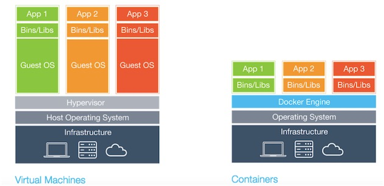

= Guide Dokcer
Yves Guerard Syapze Danga <yves.syapze@2025.ucac-icam.com>
Mars 1, 2024
:toc:
:icons: font


Ce guide vous presente:

. Qu'est-ce que Docker ?
. Les avantages de docker
. L'Architecture de docker 
. Les notions essentielles de Docker


== Mise en situation

Dans un village côtier, Marie et Éric se lancent dans des aventures passionnantes de jardinage et de pêche.

Marie, jardinière, cultive des légumes dans son jardin en utilisant des méthodes de jardinage fastidieuses et exploitant énormément de ressources (de l'eau et son précieux temps). Son jardin est magnifique, mais elle se tue à maintenir ses plantes en vie.

Éric, un pêcheur expérimenté, s'en va en mer sur son vieux bateau pour pêcher du poisson. Confiant, il réalise toujours de bonnes prises avec son bateau qui commence à s'endommager.

Un jour, un problème survient : Marie et Éric se retrouvent dans une situation particulière. La sécheresse met Marie en larmes pour son jardin et Éric rencontre désormais des difficultés lorsqu'il se rend en mer avec son bateau endommagé.

Un beau jour, leur ami Daryl vient avec une solution inattendue : Docker.

Marie décide d'adopter Docker pour son jardin, en créant des zones d'irrigation goutte à goutte efficaces qui utilisent moins d'eau tout en nourrissant ses plantes. Pendant ce temps, Éric utilise Docker pour isoler les zones endommagées de son bateau, lui permettant de continuer à naviguer en toute sécurité pendant qu'il effectue les réparations nécessaires.

Docker devient le héros inattendu ; Marie et Éric découvrent comment optimiser leurs ressources et améliorer leur efficacité. Le jardin de Marie prospère avec moins d'eau utilisée, tandis qu'Éric navigue en mer en toute confiance, sachant qu'il peut compter sur une gestion efficace des ressources de son bateau.


== Introduction

Docker est un logiciel de virtualisation léger et libre permettant d'emballer une application et ses dépendances de façon isolée et pouvant s'exécuter sur n'importe quel serveur.

[https://docs.docker.com/get-started/overview/] (Docker)


== Presentation de Docker 

Docker est une plateforme ouverte pour développer, expédier et exécuter des applications. Docker permet de séparer des applications de l'infrastructure afin de fournir des logiciels rapidement, grâce à l'aide des conteneurs. 

Un conteneur est une instance d'exécution isolée, permettant d'exécuter chaque service d'une application de façon indépendante. Il se base sur la virtualisation LXC (Linux Container), qui a pour principe de faire tourner des environnements Linux isolés les uns des autres. Contrairement aux machines virtuelles, qui virtualisent tout un système d'exploitation, les conteneurs virtualisent uniquement l'environnement d'exécution de l'application, en partageant le noyau du système d'exploitation sous-jacent avec d'autres conteneurs.

=== Architecture Docker



L'architecture de Docker repose sur une approche client-serveur comprenant plusieurs composants interagissant les uns avec les autres pour gérer les conteneurs et les images Docker. 

Voici quelques-uns des principaux composants de Dcoker :

- *Client Docker* : Le client Docker est l'interface en ligne de commande (CLI) utilisée par les utilisateurs pour interagir avec Docker.

- *Docker Daemon* : Le daemon Docker est un processus en arrière-plan qui gère la création, l'exécution et la gestion des conteneurs Docker. Il écoute les commandes du client Docker via l'API Docker et s'occupe des opérations telles que le démarrage, l'arrêt, la construction et le transfert d'images Docker.

- *Images Docker* : Les images Docker sont des modèles utilisés pour créer des conteneurs. Elles contiennent le système de fichiers de l'application, ses dépendances, ses configurations et les instructions pour exécuter l'application. Les images Docker sont partagées et réutilisées via Docker Hub.


L'architecture de Docker repose sur une approche de virtualisation légère appelée virtualisation par conteneur. Comparée à l'architecture des machines virtuelles (VM), nous avons quelques différences :


- Docker utilise une seule instance du système d'exploitation hôte, partagée entre tous les conteneurs. Chaque conteneur exécute son propre processus isolé.

- Les machines virtuelles utilisent une virtualisation matérielle pour créer des environnements isolés, où chaque VM exécute son propre système d'exploitation invité.

- Les machines virtuelles sont moins portables que les conteneurs Docker, car elles sont étroitement liées au matériel.


== Guide d'installation

image::docker.png[]


=== Prérequis

Avant d'installer Docker, assurez-vous que l'ordinateur hôte répond aux prérequis suivants :

- Version 3.10 ou supérieure du noyau Linux. 
- git Version 1.7 ou supérieure.
- Disposez d'un compte Docker Hub.

NOTE: Comme Docker est conçu pour les systèmes Linux, vous avez également besoin d'un logiciel de virtualisation tel que WSL 2 (Windows Subsystem for Linux 2) pour les systèmes Windows.


==== Installation Windows & MacOS

Via le lien suivant, choisissez dans le menu déroulant la version correspondant à votre système : 
https://www.docker.com/products/docker-desktop/

- Lancez l'excecutable et suivez la procédure d'installation.

==== Installation Linux

- Accédez au lien suivant :  https://docs.docker.com/desktop/install/linux-install/ ;

- Choisissez la plateforme d'installation qui vous correspond.
- Suivez les étapes de requête telles que définies dans la documentation.
- Excécutez Docker.


== Concepts clés de Docker

=== Le docker Hub

Le Docker Hub est un registre de contenu où sont stockées les images Docker. Il permet :

- Aux développeurs de distribuer des images prêtes à l’emploi et de les versionner avec un système de tags.
- Aux outils d’intégration continue de lancer une suite de tests, sans avoir besoin d'autre chose que Docker.
- Aux systèmes automatisés de déployer ces applications sur vos environnements de développement et de production.

Pour récupérer une image depuis le Docker Hub et pouvoir l'utiliser, il suffit de lancer la commande suivante :

[source]
----
$ docker pull <image_name>
----

En lançant cette commande, vous téléchargez une image directement depuis le Docker Hub et vous la stockez en local sur votre ordinateur.

=== Une Image

Une image Docker est un modèle de fichiers isolé contenant tout le nécessaire pour exécuter une application. Cela inclut les dépendances, le code, les bibliothèques système, les variables d'environnement et les configurations. Grâce aux images, nous obtenons un environnement cohérent permettant à une application de s'exécuter sur n'importe quelle plateforme prenant en charge Docker.

Les images docker reposent sur differents points clés tel queLes images Docker reposent sur différents points clés tels que:

- La modularité : Une image peut être combinée à une autre pour créer des environnements personnalisables et stables.

- L'immuabilité : Une image, une fois créée, reste inchangée, permettant une reproductibilité.

En plus de pouvoir obtenir une image sur Docker via le Docker Hub, nous pouvons créer nos propres images personnalisées via des Dockerfiles.

=== Dockerfile

Un Dockerfile est un fichier Docker composé de séries d'instructions, nous permettant de créer une image Docker. Les avantages de disposer de ce type de fichier pour la création de nos images sont :

- La personnalisation : Grâce à un Dockerfile, nous pouvons personnaliser notre image en incluant les dépendances liées à notre application.

- L'automatisation : En disposant d'un Dockerfile, nous pouvons automatiser les processus de création d'une image de manière rapide et efficace pour accélérer le cycle de développement.

- Contrôle de version : Les Dockerfiles peuvent être utilisés avec un système de contrôle de version comme Git.


Un Dockerfile est comparable à une recette de cuisine décrivant une image. Chaque instruction comprise dans le Dockerfile correspond à une étape (layer) de notre recette de cuisine.

Un dockerfile se constitue generalement des élements suivants:

Directive FROM : Spécifie l'image de base à utiliser comme point de départ pour la construction de la recette (de l'image).

Directives RUN : Exécute des commandes dans l'environnement de de l'image, telle que la mise à jour des paquets, etc.

Directive COPY : Copie des fichiers sources depuis le système de fichiers de l'hôte vers l'image.

Directive WORKDIR : Définit le répertoire de travail à utiliser.

Directive EXPOSE : Déclare les ports sur lesquels l'application en cours d'exécution écoute les connexions.

Directive CMD ou ENTRYPOINT : Spécifie la commande par défaut à exécuter lorsque notre recette est complete.

[source, dockerfile]
----
# Exemple de Dockerfile

# Image Node.js comme point de départ
FROM node:14

WORKDIR /app

COPY . .

# Installation des dépendances de l'application
RUN npm install

EXPOSE 3000

CMD ["npm", "start"]

----
Ce Dockerfile utilise une image Node.js comme base, installe les dépendances de l'application, copie les fichiers source et expose le port 3000 pour l'application web.

Enfin pour finaliser et contruire notre image, la commande a executer, dans le repertoire ou se situe le dockerfile, est la suivante:

```
 docker build -t <image_name>.

```

-t <image_name> Nous permet ici de donner un nom a notre image


=== Conteneur

Un conteneur dans le cadre de Docker représente une instance isolée en cours d'exécution. Il permet de virtualiser l'environnement d'exécution de l'application en isolant le processus (l'instance) et les ressources de manière légère, permettant un gain en performance.

Un conteneur Docker se crée suite à l'exécution d'une image.

[source]
----
 docker run <image_name>.
----

Pour toujours faire l'analogie avec la cuisine, un conteneur, lorsque nous avons notre recette (Dockerfile), nous décidons de la construire. À la suite, nous obtenons un plat prêt à servir contenant toutes les dépendances (ingrédients) nécessaires.

Pour consulter si notre conteneur est bien lancé, nous pouvons exécuter la commande:

[source]
----
$ docker ps
----

Enfin lorsque nous avons terminé avec notre conteneur (le plat) il faut le stopper.

[source]
----
# Commande pour arrêter un conteneur docker

 docker stop <image_name>.
----

=== Docker Compose

Après avoir déployé nos conteneurs, nous devons simplifier la gestion de l'infrastructure. Docker Compose, à l'aide d'un fichier YAML, vient nous permettre de gérer et de configurer plusieurs conteneurs. Comme brièvement énoncé précédemment, Docker Compose vient résoudre de nombreux problèmes :

- Complexité de configuration : Le déploiement de plusieurs conteneurs peut être compliqué en raison de la gestion des dépendances liées à chaque service, le volume, le port, etc. Grâce à Docker Compose, nous pouvons tous les aspects de notre application dans un seul fichier.

- Reproductibilité d'environnement : Docker Compose facilite la création d'environnements de développement cohérents et reproductibles.

- Gestion des services : Docker Compose permet de démarrer, d'arrêter, de mettre à jour et de gérer l'ensemble des services d'une application multi-conteneurs à l'aide de simples commandes en ligne de commande, facilitant les opérations de maintenance des applications.

Toujours par analogie avec la cuisine, imaginez un dîner à plusieurs (une application). Chaque plat (service) nécessite une combinaison d'ingrédients et une certaine méthode de cuisson. Il serait difficile de coordonner la préparation de tous ces plats pour qu'ils soient prêts à être servis en même temps, sans la présence d'un chef (Docker Compose) chargé de coordonner.

[source]
----
# Exemple de fichier de Docker Compose

version: '3.8'

services:
  web:
    image: nginx:latest
    ports:
      - "8080:80"
    volumes:
      - ./html:/usr/share/nginx/html
    networks:
      - mynetwork

  db:
    image: mysql:latest
    environment:
      MYSQL_ROOT_PASSWORD: rootpassword
      MYSQL_PASSWORD: mypassword
    volumes:
      - db_data:/var/lib/mysql
    networks:
      - mynetwork

----
Nous avons deux services : web qui utilise l'image NGINX pour servir des fichiers statiques, et db qui utilise l'image MySQL pour une base de données.


=== Docker Swarm

Docker Swarm est la solution d'orchestration des conteneurs de Docker. Il permet de gérer les clusters de nœuds Docker, où chaque nœud exécute des conteneurs participant à l'ensemble de la gestion du système. Docker Swarm assure:

- Le déploiement d'applications en production via son évolutivité automatique.

- La haute résilience qui offre une haute disponibilité en redondant les services sur plusieurs nœuds du cluster.

- La gestion d'architecture basée sur microservices, permettant de déployer et mettre à jour facilement chaque composant de l'application de manière indépendante.

En maintenant nos standards, Docker Swarm est comme un grand restaurant avec une équipe de chefs, chacun responsable d'une partie de la cuisine. Chaque chef (nœud Docker) prépare ses plats (conteneurs) et se coordonne avec d'autres chefs pour s'assurer que les plats sont prêts à être servis en même temps. Le chef principal (Swarm Manager) orchestre l'ensemble du processus et assure une expérience culinaire cohérente et de haute qualité pour les clients.


=== Reseau

Dans Docker, le réseau permet à des conteneurs différents de communiquer entre eux et avec d'autres ressources. Cela vise à isoler les communications entre conteneurs et à mieux les sécuriser. Sur Docker, on distingue plusieurs types de réseaux :

- Bridge Network : Permet la création d'un pont entre le conteneur et l'hôte Docker.

- Host Network : Les conteneurs partagent le même espace réseau que l'hôte Docker, offrant des performances réseau plus élevées mais moins d'isolation.

- Overlay Network (Réseau Superposé) : Garantit la connexion de conteneurs sur différents hôtes Docker (Docker Swarm).

- Macvlan Network : Attribue des adresses Mac distinctes aux conteneurs, apparaissant comme des machines physiques distinctes.

Les réseaux Docker offrent une flexibilité et une gestion efficace des communications entre les conteneurs, permettant de déployer des applications souvent distribuées et hautement disponibles.

Pour définir un réseau entre des conteneurs Docker, on utilise la commande:

[source]
----
$ docker network create <network_name>
----

Une fois le réseau créé, vous pouvez connecter des conteneurs à ce réseau:

[source]
----
$ docker run --network network_name nom_de_l_image

----


=== Volume

Les volumes dans Docker sont des mécanismes permettant de persister les données générées ou utilisées par les conteneurs Docker. Ils permettent aussi le partage et le stockage de données entre les conteneurs et l'hôte.

Il existe différents types de volumes :

- Volumes de stockage (par défaut) : Ils sont utilisés pour stocker des données applicatives, des fichiers de configurations, des fichiers de bases de données.

- Volumes liés (Bind Mounts) : Ils permettent de monter un fichier ou un répertoire de la machine hôte dans un conteneur. Ils sont utiles pour le partage de fichier entre l'hôte et le conteneur.

- Volumes TMPFS : Ils représentent un volume qui stocke en mémoire volatile et non persistante.

Pour les volumes differntes commandes sont utilisées :


Création de volume :
[source]
----
$ docker volume create <volume_name>
----

Création d'un conteneur avec un volume lié :
[source]
----
$ docker run -v chemin_absolu_hote:chemin_destination_conteneur nom_de_l_image
----

Lister les volumes
[source]
----
$ docker volume ls
----

Suppression d'un volume
[source]
----
$ docker volume rm nom_du_volume
----

Inspection d'un volume
[source]
----
$ docker volume inspect nom_du_volume
----


== Bonnes pratiques

. Images officielles : Toujours utiliser des images officielles ou des images provenant de sources fiables.

. Taille des images : Utiliser des images de taille légère lorsque c'est possible (comme Alpine), permettant d'éviter les images surchargées et les multiples dépendances.

. Création d'images avec Dockerfile : Pour vos besoins personnalisés, n'hésitez pas à les créer à l'aide des Dockerfiles. Lors de la création de vos Dockerfiles, réduisez au maximum le nombre de couches.

. Versionning : Versionner vos Dockerfiles ainsi que les différentes configurations liées à l'infrastructure Docker pour une traçabilité de déploiement.

. Documentation : Documenter l'intégralité de votre travail (Dockerfile, infrastructure, etc.), pour permettre à chaque membre de l'équipe de travailler efficacement.


== Conclusion

En conclusion, Docker nous offre une approche nouvelle pour le développement et le déploiement d'applications, par ses principes de virtualisation légère et efficace à travers des conteneurs. Grâce à Docker, nous pouvons créer des environnements de développement cohérents et portables ainsi effectuer des déploiements de manière fiable et reproductible, réduisant ainsi les risques d'incohérences. 


